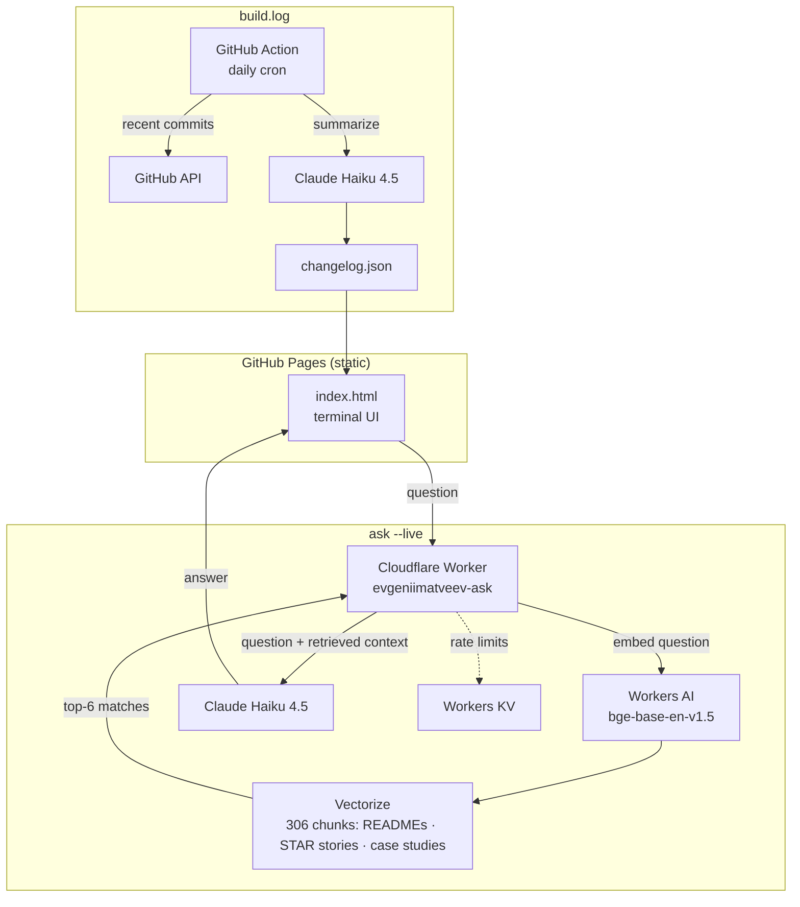

# evgeniimatveev.github.io

A terminal-emulator portfolio site — no framework, one `index.html`, styled and scripted to feel like a live server session. Everything on it is real: live uptime data, real postmortems, a live ask widget grounded in RAG, and a changelog written by AI from actual commits.

**[🌐 Live site →](https://evgeniimatveev.github.io/)**


---

## What's on it

- **`whoami` / `systemctl status --all`** — identity, stack, and a live uptime snapshot across 9 deployed apps
- **`ls projects/`** — 12 deployed portfolio projects, sorted by impact, each with live demo + source links
- **`cat POSTMORTEM.md`** — real incident write-ups (root cause, fix, verification), not sanitized case studies
- **`ask --live`** — type a question, get a real answer from Claude, grounded via RAG over the actual project corpus (see below)
- **`tail -f build.log`** — a daily AI-generated changelog summarizing real commits across every tracked repo
- **`cat infra.log`** — the operational reality: keepalive strategy, monitoring, CI/CD, written honestly

## Architecture



Two independent AI features, two different techniques on purpose:

| | `ask --live` | `build.log` |
|---|---|---|
| Trigger | User question | Daily cron |
| Grounding | RAG (Vectorize + Workers AI embeddings) | Direct context (recent commit messages) |
| Model | Claude Haiku 4.5 | Claude Haiku 4.5 |
| Why this approach | Corpus (306 chunks, 33 repos) too large to stuff into every prompt | Small, one-shot input — no retrieval needed |

## The RAG corpus

Built from real, public sources — not invented content:

- All 33 public repo READMEs (cleaned of badges/HTML noise, chunked by section)
- 11 achievement-focused STAR interview stories (curated — no "weaknesses" or "why I'm leaving" content, that's for real interviews, not a public bot)
- Site case studies / postmortems
- Bio facts, verified against primary sources when corrected (see `worker/rag/build_corpus.py` for the full pipeline)

Rebuilding it after a source changes:
```bash
cd worker/rag
python build_corpus.py
ADMIN_KEY=<key> python ingest.py
```

Full write-up of the pipeline, retrieval debugging, and deploy steps: [`worker/README.md`](worker/README.md).

## Stack

`HTML/CSS/vanilla JS` · `Cloudflare Workers` · `Workers AI` · `Vectorize` · `Workers KV` · `Claude API (Haiku 4.5)` · `GitHub Actions` · `GitHub Pages`

## Repo structure

```
.
├── index.html              # the entire site — terminal UI, styles, and client JS
├── changelog.json           # AI-generated daily changelog, read by build.log
├── worker/
│   ├── worker.js             # Cloudflare Worker: ask endpoint + RAG retrieval + admin routes
│   ├── wrangler.toml          # KV / Vectorize / Workers AI bindings
│   ├── rag/
│   │   ├── build_corpus.py     # cleans + chunks READMEs/STAR stories/facts into corpus.jsonl
│   │   ├── ingest.py            # embeds + upserts corpus.jsonl into Vectorize
│   │   ├── readmes/              # cached source READMEs
│   │   └── star_stories.json      # curated interview stories
│   └── README.md              # full deploy + RAG pipeline docs
├── scripts/
│   └── generate-changelog.mjs  # summarizes daily commits via Claude for build.log
└── .github/workflows/
    └── ai-changelog.yml        # daily cron running the changelog script
```

## Local dev

It's a static file — open `index.html` directly, or serve it:
```bash
python -m http.server 8000
```
`ask --live` and `build.log` need the Cloudflare Worker deployed and `ANTHROPIC_API_KEY` set to work — see [`worker/README.md`](worker/README.md).

---

*Built with Claude Code · deployed on GitHub Pages*
